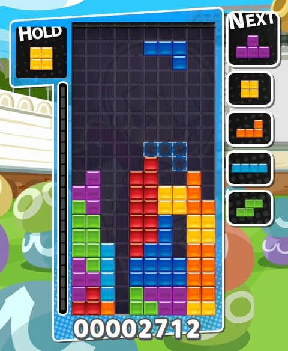
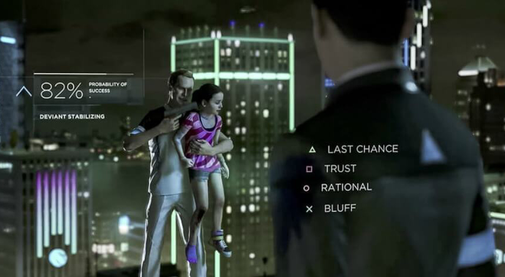

## Introducción
*"Desde el inicio de los videojuegos es habitual que el jugador deba enfrentarse a la toma de decisiones, desde los juegos más sencillos como Tetris -donde debes decidir donde color la siguiente pieza- hasta juegos más complejos como Detroit: Become Human, en el cual cada acción que realizas y cada dialogo que escoges tiene un impacto en la historia."*

 

## Acerca De

Esta es la premisa de mi Trabajo Final de Grado o Tesis, la cuál investiga respecto a la influencia que tienen los videojuegos en la influencia de los usuarios, más especificamente, cuál es la influencia que tienen los dilemas morales en estas decisiones.

Puedes leer un resumen de la memoria [aquí](Resumen/main.pdf) o la memoria completa [aquí](Memoria/main.pdf).

## Codigo Fuente

Si quieres ver el codigo fuente del videojuego implementado para esta memoria, puedes dirigirte a [este repositorio de GitHub](https://github.com/Jfriffoa/TFG).
